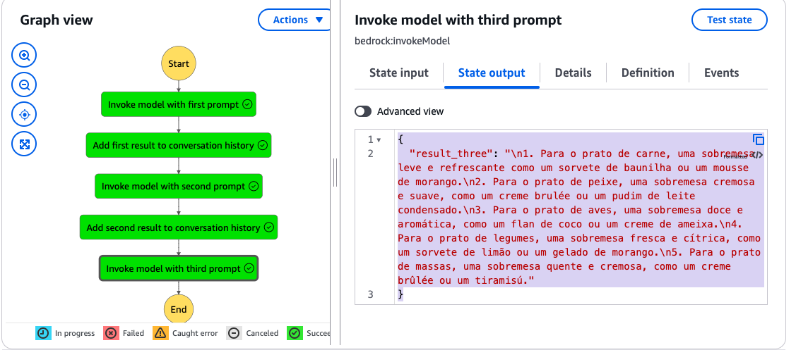

# Desafio de projeto

O desafio consistia em criar um assistente de delivery usando AWS step functions com Bedrock. A fim de conectar com o desafio anterior do personal trainer IA, solicitei sugestões de comida, bebida e sobremesa saudáveis. O código ALS (Amazon States Language), baseado em json, da solução encontra-se no arquivo codigo.json desta pasta. Utilizei o modelo de IA Titan Text G1 - Express da Bedrock. O input e o output do último bloco são os códigos abaixo em json.

    

## INPUT do último bloco de execução:

{  
  "prompt_one": "Idéias de comida",  
  "prompt_two": "Idéias de bebida",  
  "prompt_three": "Idéias de sobremesa",  
  "result_one": {  
    "result_one": "\n1. Salada de folhas verdes com grão-de-bico e camarão grelhado\n2. Salmão grelhado com salada de rúcula e abacate\n3. Frango grelhado com quinoa e legumes assados"  
  },  
  "convo_one": {  
    "convo_one": "Idéias de comida\n\n1. Salada de folhas verdes com grão-de-bico e camarão grelhado\n2. Salmão grelhado com salada de rúcula e abacate\n3. Frango grelhado com quinoa e legumes assados"  
  },  
  "result_two": {  
    "result_two": "\n1. Suco de laranja: rico em vitamina C, é uma ótima opção para acompanhar pratos salgados.\n2. Chá verde: possui propriedades antioxidantes e é ótimo para acompanhar pratos mais leves.\n3. Água: é a bebida mais saudável e pode ser consumida em qualquer momento.\n4. Vinho tinto: consumido com moderação, é uma ótima opção para acompanhar pratos mais elaborados.\n5. Suco de beterraba: rico em nutrientes, é uma ótima opção para acompanhar pratos mais saudáveis."  
  },  
  "convo_two": {  
    "convo_two": "Idéias de comida\n\n1. Salada de folhas verdes com grão-de-bico e camarão grelhado\n2. Salmão grelhado com salada de rúcula e abacate\n3. Frango grelhado com quinoa e legumes assados\nIdéias de bebida\n\n1. Suco de laranja: rico em vitamina C, é uma ótima opção para acompanhar pratos salgados.\n2. Chá verde: possui propriedades antioxidantes e é ótimo para acompanhar pratos mais leves.\n3. Água: é a bebida mais saudável e pode ser consumida em qualquer momento.\n4. Vinho tinto: consumido com moderação, é uma ótima opção para acompanhar pratos mais elaborados.\n5. Suco de beterraba: rico em nutrientes, é uma ótima opção para acompanhar pratos mais saudáveis."  
  }  
}  

## OUTPUT do último bloco de execução:

{  
  "result_three": "\n1. Para o prato de carne, uma sobremesa leve e refrescante como um sorvete de baunilha ou um mousse de morango.\n2. Para o prato de peixe, uma sobremesa cremosa e suave, como um creme brulée ou um pudim de leite condensado.\n3. Para o prato de aves, uma sobremesa doce e aromática, como um flan de coco ou um creme de ameixa.\n4. Para o prato de legumes, uma sobremesa fresca e cítrica, como um sorvete de limão ou um gelado de morango.\n5. Para o prato de massas, uma sobremesa quente e cremosa, como um creme brûlée ou um tiramisú."  
}

